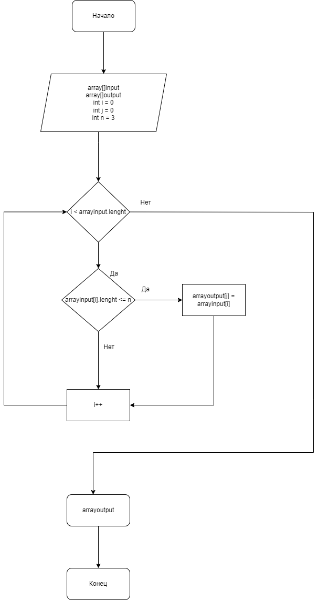

# Итоговая проверочная работа 

## Задача:

Написать программу, которая из имеющегося массива строк формирует массив из строк, длина которых меньше либо равна 3 символа. Первоначальный массив можно ввести с клавиатуры, либо задать на старте выполнения алгоритма. При решение не рекомендуется пользоваться коллекциями, лучше обойтись исключительно массивами.

# Алгоритм решения задачи:

1: _Делаем перебор значений исходного массива._

2:_Проверяем каждый элемент массива на соответствие условию_:__lenght <= 3.__

3:_Если условие сблюдается, то значение отправляется в новый массив._

4:_Повторяем выше написанные действия до тех пор, пока не достигнем конца исходного массива._

5:_Новый заполненый массив записываем в результат и выводим._

# Блок-схема алгоритма решения задачи:

# Рабочая программа:

## **Сама программа будет находиться в папке _FinalTask_, в  файле**: _Program.cs_